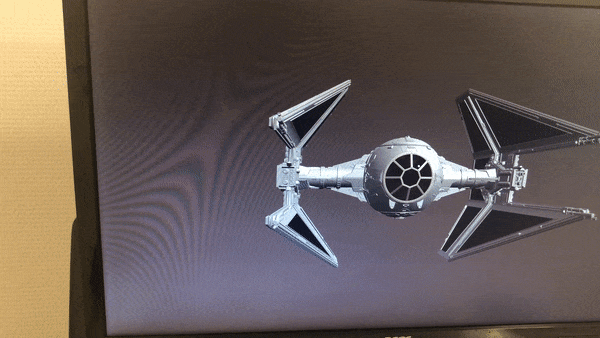

# Simulating depth perception with face tracking

[Motion parallax](https://en.wikipedia.org/wiki/Depth_perception#Monocular_cues) is created by the apparent relative motion of objects when an observer moves. It's one of the monocular cues that enable depth perception. This [demo](https://vivien000.github.io/trompeloeil/) simulates this phenomenon thanks to [TensorFlow.js](https://www.tensorflow.org/js/models) and [three.js](https://threejs.org/).

## Usage

Just launch the [demo](https://vivien000.github.io/trompeloeil/) with Chrome, Firefox or Edge on your webcam-equipped laptop or desktop and wait a little. You can add *[?object=1](https://vivien000.github.io/trompeloeil/?object=1)* or *[?object=2](https://vivien000.github.io/trompeloeil/?object=2)* at the end of the URL to try other 3D models.

## Detecting the orientation of the camera/face axis

I take advantage of TensorFlow.JS' [Face Landmarks Detection model](https://github.com/tensorflow/tfjs-models/tree/master/face-landmarks-detection), which provides the location of 468 face landmarks from the webcam's video stream. I just keep a single one of them, which is located between the two eyes, and compute the corresponding azimuthal and polar angles. With these coordinates, I can then move a three.js camera and render the 3D scene from the proper angle.

The resulting image is very stable, which suggests that the model's predictions are pretty accurate. I also tried a [simpler and faster model](https://github.com/tensorflow/tfjs-models/tree/master/blazeface) (and you can too by adding *[?blaze=true](https://vivien000.github.io/trompeloeil/?blaze=true)*) but this makes the demo a bit too jittery.

## Detecting the distance between the face and the camera

The Face Landmarks Detection model also optionally predicts the location and shape of the irises. Since the human iris' size is [remarkably constant](https://google.github.io/mediapipe/solutions/iris#depth-from-iris), we can then estimate the distance between the camera and the eyes if we know the webcam's focal length. This distance should be taken into account to determine the field of view of the three.js camera. However, this estimate is too noisy and I didn't use it (but you can still see that by yourself with *[?distanceMethod=1](https://vivien000.github.io/trompeloeil/?distanceMethod=1)*). I also [tried](https://vivien000.github.io/trompeloeil/?distanceMethod=2) to use the distance between the facial landmark between the two eyes and one on the forehead (such distance should be globally invariant to facial expressions and left/right rotations of the head). This was a bit more stable but still unsatisfying. At the end of the day, I assumed that the distance between the observer's face and the camera is constant.

## Limitations

Theoretically, I shouldn't just position the three.js camera where the observer's face was detected. I should also warp the resulting image to account for the fact that the camera plane and the screen's plane aren't parallel. I didn't do it but I don't think it makes a big difference given the relatively narrow field of view of most webcams.

Besides, it'd be more efficient to compute the predictions in a web worker. Unfortunately enough, I understand it's only possible to use TensorFlow.js and WebGL in a worker when OffscreenCanvas is available, which is currently not the case for some browsers, e.g. [Firefox](https://caniuse.com/offscreencanvas).

## Acknowledgements

I was inspired by this [old demo](https://youtu.be/Jd3-eiid-Uw) (2007!) from [Johnny Lee](https://twitter.com/johnnychunglee).

Thanks to Google, the TensorFlow.JS community and the three.JS community for making available such cool libraries. I used [Discover three.js](https://discoverthreejs.com/), a great interactive book by [Lewy Blue](https://twitter.com/lewy_blue), to get started with three.js. Thanks also to my friend Fabien for his feedback.

Credits for the 3D models:
- [Tie Interceptor](https://skfb.ly/6oZzr) by [StarWars-Universe](https://sketchfab.com/SWU)
- [Parrot](https://github.com/mrdoob/three.js/tree/dev/examples/models/gltf) by [three.js](https://threejs.org/)
- [Van Gogh 3D](https://sketchfab.com/3d-models/van-gogh-3d-be055097ec1942269450952a3983098d) by [federico.lorenzin](https://sketchfab.com/federico.lorenzin)
